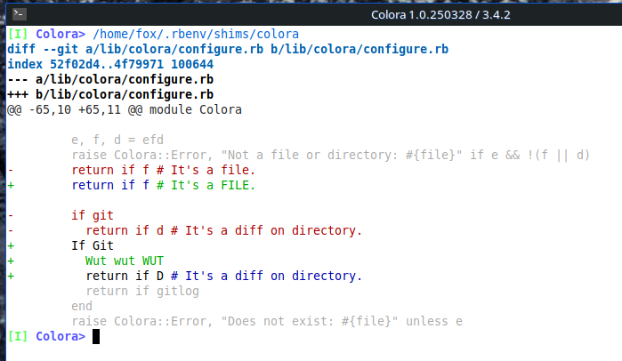

# Colora

* [VERSION 1.0.250327](https://github.com/carlosjhr64/colora/releases)
* [github](https://www.github.com/carlosjhr64/colora)
* [rubygems](https://rubygems.org/gems/colora)

## DESCRIPTION

Colorizes terminal outputs.

Uses `Rouge::Formatters::Terminal256` to theme/color output to the terminal.
Color codes git diff.

## INSTALL
```console
$ gem install colora
```
## SYNOPSIS
```console
$ colora ./README.md     # Color outputs file
$ cat README.md | colora # Colorizing filter
$ colora --git lib       # Git-diff with target
$ colora                 # Git-diff default
```
## GIT-DIFF FILTERING



Colora will decorate your git-diff output with the following additional flags:

* Absent: `*`
* Deleted: `<`
* Inserted: `>`
* Moved/Touched: `t`
* Edited: `e`
* Duplicated: `d`

The flags are the first three characters of the diff line,
the first coming from git.
The second and third refer to the code and comment of the diff line
(Colora assumes comments as in Ruby).
One can choose to filter(via command line options) the diff output to:

* Filter out context lines(quiet)
* Just view green(inserted lines)
* Just view red(deleted lines)
* Just view edited code or comments
* Just view duplicated code or comments

Additional features:

* Swap tabs with tab symbol
* Switch to a different theme(as provided by Rouge)

## HELP
```console
$ colora --help
Usage:
  colora [:options+] [<file=FILE>]
Options:
  -q --quiet
  -g --green     	 Skip red:   /^[-<]/
  -r --red       	 Skip green: /^[+>]/
  -c --code      	 Show only new(changed) code
  -C --comment   	 Show only new(changed) comments
  -d --dupcode   	 Show only duplicate code
  -D --dupcomment	 Show only duplicate comments
  -G --git       	 Run git-diff
  -t --tab       	 Swap tab with ⇥
  --theme=NAME   	 Rouge theme(default: github)
  --lang=NAME    	 Language being diffed(default: ruby)
Types:
  FILE /^[-\w\.\/]+$/
  NAME /^[\d.a-z_]+$/
Exclusive:
  green red
# Notes: #
When no FILE is given and STDIN in a TTY, git-diff is run.
Known themes:
  base16 base16.monokai base16.solarized bw
  colorful
  github gruvbox
  igorpro
  magritte molokai monokai monokai.sublime
  pastie
  thankful_eyes tulip
```
## LICENSE

Copyright (c) 2025 CarlosJHR64

Permission is hereby granted, free of charge,
to any person obtaining a copy of this software and
associated documentation files (the "Software"),
to deal in the Software without restriction,
including without limitation the rights
to use, copy, modify, merge, publish, distribute, sublicense, and/or sell
copies of the Software, and
to permit persons to whom the Software is furnished to do so,
subject to the following conditions:

The above copyright notice and this permission notice
shall be included in all copies or substantial portions of the Software.

THE SOFTWARE IS PROVIDED "AS IS",
WITHOUT WARRANTY OF ANY KIND, EXPRESS OR IMPLIED,
INCLUDING BUT NOT LIMITED TO THE WARRANTIES OF MERCHANTABILITY,
FITNESS FOR A PARTICULAR PURPOSE AND NONINFRINGEMENT.
IN NO EVENT SHALL THE AUTHORS OR COPYRIGHT HOLDERS BE LIABLE FOR ANY CLAIM,
DAMAGES OR OTHER LIABILITY, WHETHER IN AN ACTION OF CONTRACT,
TORT OR OTHERWISE, ARISING FROM, OUT OF OR IN CONNECTION WITH
THE SOFTWARE OR THE USE OR OTHER DEALINGS IN THE SOFTWARE.
